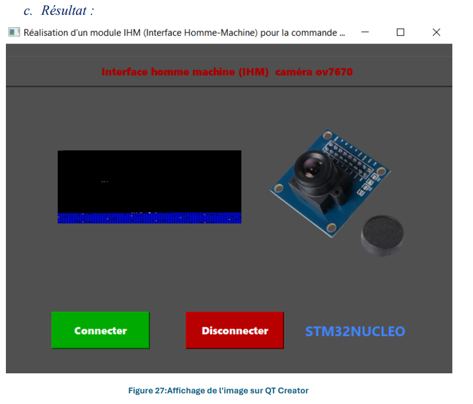

# Project Title :Creation of a graphical interface 
HMI (human machine interface) creation for controlling a train's onboard video transmission system using QT-Creator /STM32/I2C/UART/C/C++/STM32.
<h2>Description:</h2>
This project demonstrates how to interface an STM32 microcontroller with an OV7670 camera module using the I2C protocol to capture data. 
The captured data is then transmitted to a computer via UART. On the computer side, 
the data is read using QT Creator's QSerialPort module and displayed as an image using QLabel in a C++ application.
<h2>Table of Contents:</h2>
<ul>
  <li>Project Title</li>
  <li>Description</li>
  <li>Table of Contents</li>
  <li>Features</li>
  <li>Hardware Requirements</li>
  <li>Software Requirements</li>
  <li></li>
  <li>Setup Instructions</li>
  <li>Result</li>
</ul>
<h2>Features:</h2>
<ul>
  <li>Interface OV7670 camera with STM32 using I2C protocol</li>
  <li>Transmit captured data to a computer via UART</li>
  <li>Read and process the transmitted data using QT Creator's QSerialPort</li>
  <li>Display the processed data as an image using QLabel in a C++ application</li>
</ul>
<h2>Hardware Requirements:</h2>
<ul>
  <li>STM32 board (STM32F030 NUCLEO)</li>
  <li>OV7670 Camera</li>
  <li>UART converter(i used UART2 in this project because it is linked with ST link)</li>
</ul>
<h2>Software Requirements:</h2>
<ul>
  <li>STM32cudeIDE</li>
  <li>QT_Creator version 5.15.2</li>
  <li>PuTTY</li>
</ul>
<h2>Setup Instructions:</h2>
<ol>
  <li>STM32 and OV7670 Setup:</li>
  <ul>
    <li>Connect the OV7670 camera to the STM32 microcontroller using I2C.</li>
    <li>configure the I2C ssettings in STM32cudeIDE</li>
    <li>Generate and compile the code using the STM32cubeIDE</li>
  </ul>
  <li>UART Communication:</li>
  <ul>
    <li>Configure the UART settings in STM32CubeIDE.</li>
  
  </ul>
  <li>QT Creator Setup:</li>
  <ul>
    <li>Install QT Creator and set up a new project.</li>
    <li>Add the QTSerialPort module to the project.</li>
    <li>Implement the code to read data from the serial port and display it using QLabel.</li>
  </ul>
</ol>
<h2>Result:</h2>

<h2>NB:</h2>

there is a problem i encountered :The problem is that the UART protocol cannot transmit all of the image data because its maximum capacity is limited to transmitting character data.

